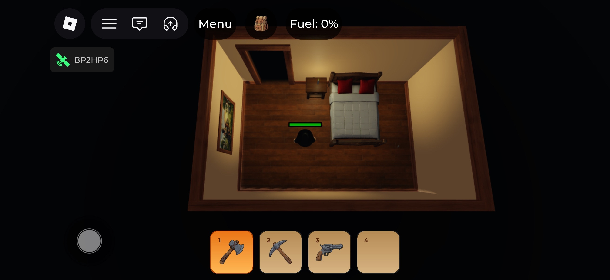
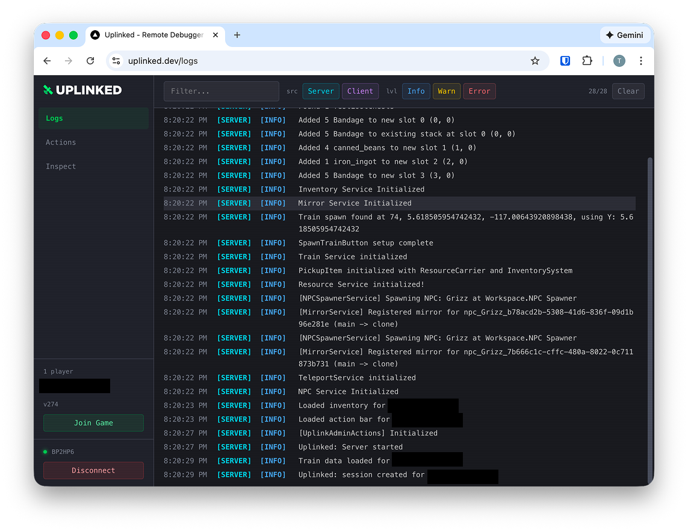
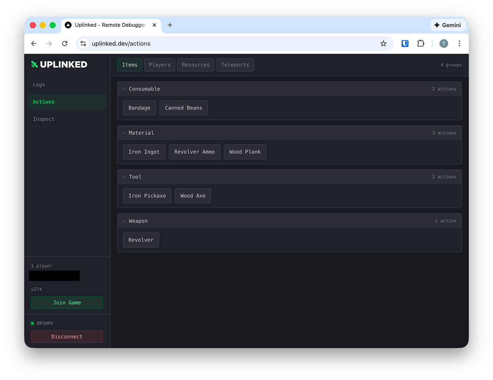
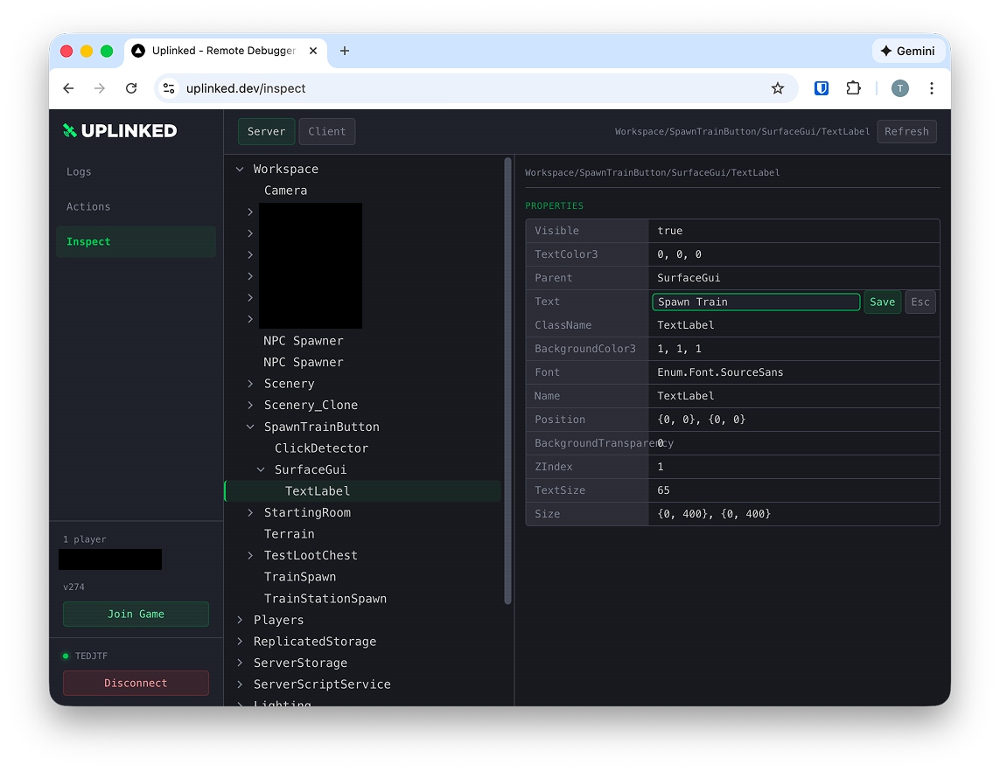

# Uplinked

Uplinked enables easy live debugging of your published Roblox game. I built it because when I tested on physical devices (mobile, console, VR) I wanted to see real-time logs on another screen, I wanted to trigger remote quick actions without creating dev UI in-game, and I wanted to be able to inpsect the workspace tree for the client and server.

## How it works
1. Setup the module in your game. Set an admin password that only you know.
2. Launch your game
3. Click the Uplinked button to start a session.
4. Open [uplinked.dev](https://uplinked.dev) in your browser
5. Enter the session ID and admin password


## Screenshots









## Features

- **Live Logs** — Stream server and client logs with filtering to another device
- **Remote Actions** — Define and trigger custom actions from the web dashboard - no custom dev UI to build
- **Instance Inspection** — Browse the instance tree, view/edit properties, attributes, and tags
- **No signup required** - You don't have to signup to use Uplinked
- **Free** - No cost. I may block users who abuse the service.

## Self-hosting
I'm planning to open source the backend soon if you want to control where your data goes.

## Installation

### Wally (Recommended)

Add to your `wally.toml`:

```toml
[dependencies]
Uplinked = "UplinkedDev/uplinked@0.1.0"
```

Then run:

```bash
wally install
```

### Roblox Model

Download `Uplinked.rbxm` from this repository and insert it into `ReplicatedStorage`.

### From Source

Requires [Aftman](https://github.com/LPGhatguy/aftman) (or Rojo and Wally installed manually).

```bash
# Install toolchain
aftman install

# Build the model file
rojo build -o Uplinked.rbxm
```

## Quick Start

Place the Uplinked module in `ReplicatedStorage`, then add the following scripts to your game.

### Server Setup

Create a `Script` in `ServerScriptService`:

```lua
local ReplicatedStorage = game:GetService("ReplicatedStorage")

local Uplinked = require(ReplicatedStorage:WaitForChild("Uplinked"))

Uplinked.Server.Start({
    Password = "changeme", -- Required: password for web clients to connect
})
```

### Client Setup

Create a `LocalScript` in `StarterPlayerScripts`:

```lua
local ReplicatedStorage = game:GetService("ReplicatedStorage")

local Uplinked = require(ReplicatedStorage:WaitForChild("Uplinked"))

Uplinked.Client.Start()
```

This adds a small button to the player's screen. Tapping it requests a debug session and displays a session code they can enter on the web dashboard.

## Configuration

### Server Options

| Option | Type | Default | Description |
|--------|------|---------|-------------|
| `Password` | string | *required* | Password that web clients must provide to connect |
| `BackendUrl` | string | `"https://uplinked.dev/api"` | Backend API URL (override for self-hosting) |
| `FlushInterval` | number | `2` | Seconds between log flushes to backend |
| `PollInterval` | number | `1` | Seconds between polling for actions/inspect requests |

### Client Options

| Option | Type | Default | Description |
|--------|------|---------|-------------|
| `ShowDefaultUI` | boolean | `true` | Show the built-in session button |
| `OnConnecting` | function | `nil` | Called when a session request starts |
| `OnSessionCode` | function | `nil` | Called with the session code string |
| `OnSessionEnded` | function | `nil` | Called when the session ends |
| `OnError` | function | `nil` | Called with an error message string |

## Remote Actions

Define custom actions that can be triggered from the web dashboard. Actions are organized into **sections** and **groups**.

Create a `Script` in `ServerScriptService`:

```lua
local Players = game:GetService("Players")
local ReplicatedStorage = game:GetService("ReplicatedStorage")

local Uplinked = require(ReplicatedStorage:WaitForChild("Uplinked"))

-- Static actions
local items = Uplinked.Actions.Section("Items")

items:Group("Weapons", {
    { name = "Rifle", callback = function(group)
        print("Giving Rifle")
    end },
    { name = "Shotgun", callback = function(group)
        print("Giving Shotgun")
    end },
})

-- Dynamic actions (add/remove groups at runtime)
local players = Uplinked.Actions.Section("Players")

Players.PlayerAdded:Connect(function(player)
    players:Group(player.Name, {
        { name = "Kill", callback = function(group)
            if player.Character and player.Character:FindFirstChild("Humanoid") then
                player.Character.Humanoid.Health = 0
            end
        end },
        { name = "Heal", callback = function(group)
            if player.Character and player.Character:FindFirstChild("Humanoid") then
                player.Character.Humanoid.Health = player.Character.Humanoid.MaxHealth
            end
        end },
    })
end)

Players.PlayerRemoving:Connect(function(player)
    players:RemoveGroup(player.Name)
end)
```

## Development

### Prerequisites

- [Aftman](https://github.com/LPGhatguy/aftman) (manages Rojo and Wally)

### Setup

```bash
aftman install
```

### Live Sync

Use Rojo to sync changes into Roblox Studio in real time:

```bash
rojo serve
```

Then connect via the Rojo plugin in Studio.

### Build

```bash
rojo build -o Uplinked.rbxm
```

## Project Structure

```
src/
├── init.lua              # Module entry point, re-exports all submodules
├── UplinkedServer.lua    # Server session management and log streaming
├── UplinkedClient.lua    # Client-side logging, UI, and session requests
├── UplinkedActions.lua   # Action registration and dispatch system
└── UplinkedInspect.lua   # Instance tree browsing and property editing
examples/
├── SampleServer.server.lua
├── SampleClient.client.lua
└── SampleActions.server.lua
```

## License

MIT
